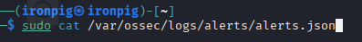
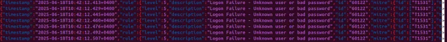
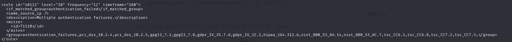

# Detecting SSH Brute-Force Attacks Using Wazuh

This project demonstrates how to detect SSH brute-force attempts using **Wazuh**, an open-source SIEM and XDR platform.

The setup involves **two Kali Linux machines**:

- **Kali Machine 1:** Wazuh Server + Dashboard  
- **Kali Machine 2:** SSH client used to generate brute-force attempts  

The project includes examining predefined Wazuh rules, verifying SSH service status, creating a custom local rule, simulating brute-force activity, and analyzing triggered alerts.

---

## Repository Structure

├── screenshots/
│ ├── wazuh-dashboard.png
│ ├── predefined-rule.png
│ ├── sshd-status.png
│ ├── local-rule.png
│ ├── triggered-alert.png
└── README.md

---

## Project Objectives

- Understand how Wazuh detects SSH login failures  
- Analyze predefined SSH rules in Wazuh  
- Simulate real SSH brute-force behavior  
- Create a custom Wazuh rule using `local_rules.xml`  
- Trigger alerts and analyze them in the Wazuh dashboard  
- Document the entire workflow for SOC analyst learning  

---

## NOTE  
This documentation does **not** cover the installation or initial setup of Wazuh.  
For installation and setup instructions, refer to the official Wazuh documentation:  
https://documentation.wazuh.com

---

## Step 1: Trigger SSH Failed Authentication Alerts

### On Kali Machine 2  
Verify SSHD service is running:

### On Kali Machine 1  

Run Hydra to generate SSH login failures:
``hydra -l root -P /usr/share/wordlists/rockyou.txt ssh://<wazuh-server-ip>``

Analyze the alerts:

---

## Step 2: Analyze Predefined Rules

On Kali Machine 1,

View the predefined SSH rules:
``sudo cat /var/ossec/ruleset/rules/0010-sshd_rules.xml``

Screenshots of analyzed rules:

  
  
  

---

## Step 3: Create Wazuh Custom Rules

On Kali Machine 1: ``sudo nano /var/ossec/etc/rules/local_rules.xml``

Custom rule example:

---

## Step 4: Restart and Test

Return to the Wazuh dashboard:

- Open **Security Events**
- Filter by your custom rule ID
- Confirm that your custom rule is triggered and labeled correctly

---

## End of Documentation

